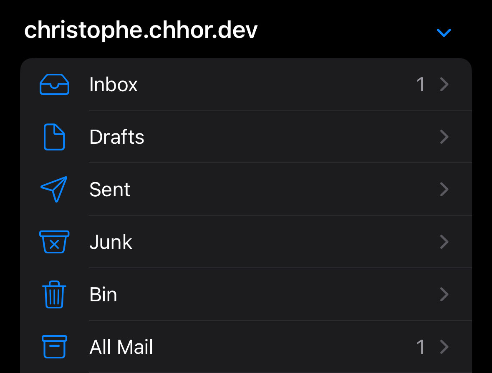
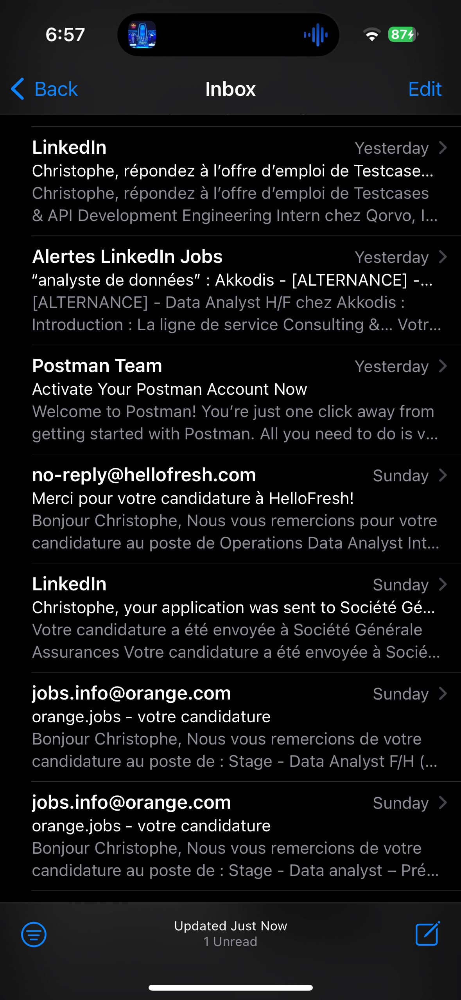
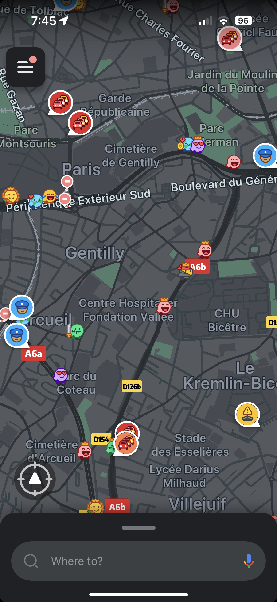
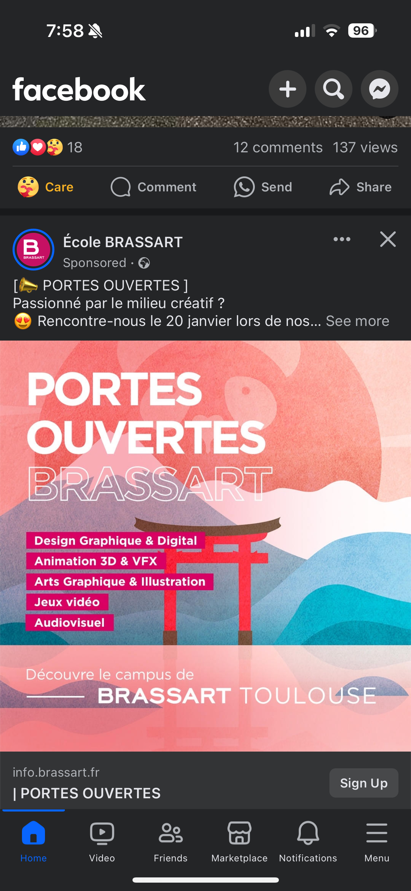

# Actu technolgie #3

# Le smartphone, l'outil trop puissant pour les + de 50ans?

Le smartphone est devenu un objet essentiel du quotidien, rassemblant les moyens de communication modernes entre les appels, les appels visio, et les messages, le smartphone peut se définir comme un ordinateur de poche avec toutes ses fonctionnalités possibles.

Mais alors, qu'est-ce qui rend si difficile d'usage pour les plus de 50 ans?

# L'interface

Chaque marque de smartphone a son interface, ou presque. Ces interfaces sont souvent inspirées entre elles, se basant sur des interfaces célèbres notamment celles des iPhones : iOS.
Chaque marque fournisse un nombre d'applications installées par défaut sur leur smartphone, et j'ai décidé de faire une liste des applications les plus utiles et accessibles en terme d'utilisation.

# Mail : une application obligatoire

Avec la digitalisation des services publics tels que l'Assurance Maladie, les Impots, etc... Avoir une adresse mail devient une formalité et un besoin nécessaire.

Sur iOS, toutes les catégories sont présentés comme montré ci-contre, avec la boite mail principale, les mails envoyés, supprimés mais aussi les spams.

Voici à quoi ressemble une boite mail sur Mail iOS.

La question qui revient souvent : que faire si on n'a pas d'adresse mail?

Lors de l'initialisation de votre smartphone, qu'il s'agisse d'un Samsung, Google, Apple, Huawei etc... Il vous sera demandé de créer un compte google, apple ou Huawei selon votre smartphone, ce dernier vous donnen une adresse mail si vous le souhaitez.

# Notes : les oublis arrivent souvent, notez-les

Avec l'âge et la pression du quotidien, les personnes ont tendance à oublier ce qu'ils doivent réaliser sur une journée, la liste de leur courses etc... L'application notes est un incontournable, transformant le smartphone en carnet.

# Waze : quand un GPS indique (presque) les radars

Waze est un gps communautaire, avec une actualisation des potentiels dangers par les utilisateurs, avec notamment le signalement de la position de la police (souvent la position des radars fixes de contrôle de vitesse). Cette application est devenu un must des automobilistes. En cas de bouchons, Waze propose des itinéraires alternatifs en fonction de la circulation.

# Facebook : le réseau social pour retrouver des connaissances

En parlant de réseau social, Facebook est l'un des réseaux sociaux les plus utilisés dans le monde. Avec l'avènement du monde digital, Facebook a permis de remettre en relation des personnes qui ont perdu contact. Pour donner un exemple concret, mon père a pu retrouver ses amis d'enfance via Facebook alors qu'ils ont un continent de distance.
Facebook a inauguré un marketplace, permettant de vendre des objets d'occasion et d'en acheter, devenant ainsi un concurrent de Leboncoin.

